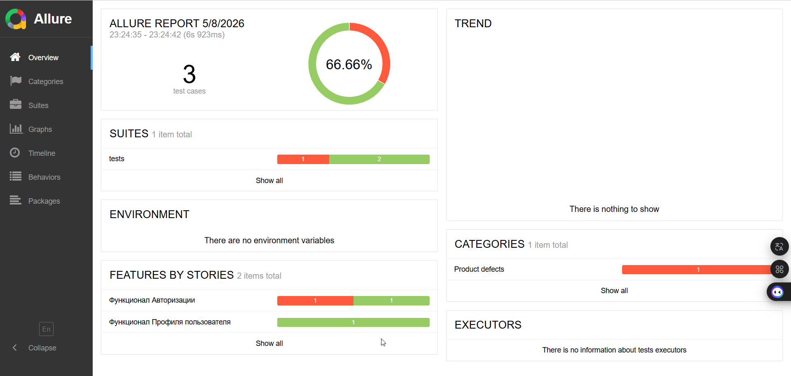

**Структура проекта**

Вот как выглядит структура нашего E2E фреймворка:

```
qa-mesto/
│
├── conftest.py
├── requirements.txt
├── pytest.ini
│
├── config/
│   ├── application.py
│   └── environments.py
│
├── pages/
│   ├── base_page.py
│   ├── home_page.py
│   └── login_page.py
│
└── tests/
    ├── test_login.py
    └── test_profile_edit.py
```

- **conftest.py** — настройки и фикстуры для pytest: управление браузером, окружениями, пользователями.
- **requirements.txt** — список библиотек (Playwright, pytest, Allure и т.д.).
- **pytest.ini** — централизованные настройки для запуска тестов.
- **config/application.py** — точка входа для всех Page Object'ов.
- **config/environments.py** — настройки окружений (dev, stage) и тестовые пользователи.
- **pages/** — Page Object Model: каждая страница приложения — отдельный класс.
- **tests/** — тестовые сценарии с Allure-аннотациями.

## 🐳 Запуск в Docker

Проект контейнеризирован. Это гарантирует, что тесты запустятся в изолированной среде с корректными версиями Python и браузеров Playwright без необходимости их локальной установки.

### Основные команды


| Команда | Описание |
| :--- | :--- |
| `docker-compose up` | Собрать (если не собран) и запустить тесты по умолчанию |
| `docker-compose up --build` | Принудительно пересобрать образ и запустить тесты |
| `docker-compose down` | Остановить и удалить созданные контейнеры |

### Гибкий запуск (конкретные тесты/браузеры)

Вы можете передавать любые параметры `pytest` напрямую в контейнер:

*   **Выбор браузера:**
    ```bash
    docker-compose run playwright-tests pytest --browser chromium
    ```
*   **Запуск по маркеру (например, smoke):**
    ```bash
    docker-compose run playwright-tests pytest -m smoke
    ```
*   **Запуск конкретного файла с тестами:**
    ```bash
    docker-compose run playwright-tests pytest tests/test_login.py
    ```

### Отчеты
После выполнения команд результаты тестов автоматически появятся в папках:
- `./allure-results` — данные для Allure.
- `./playwright-report` — стандартные отчеты (скриншоты, видео).

# 📊 Пример Allure‑отчёта




# CI/CD

Проект использует **GitHub Actions** для автоматического запуска тестов и публикации Allure‑отчёта на **GitHub Pages**.

### Триггер

Workflow запускается при создании Pull Request в ветку `main`.

### Что делает pipeline

| Джоба | Описание |
|-------|----------|
| `run-tests` | Запускает тесты через `docker compose up`, генерирует Allure‑отчёт и сохраняет его как артефакт сборки. |
| `prepare-pages` | Загружает артефакт с отчётом и подготавливает его для деплоя на GitHub Pages. |
| `deploy-to-pages` | Публикует отчёт на GitHub Pages и возвращает URL. |

### Как посмотреть отчёт

1. После завершения workflow перейдите в **Settings** → **Pages** вашего репозитория.
2. Там будет указана ссылка на опубликованный сайт (например, `https://<username>.github.io/<repo>/`).
3. Отчёт автоматически обновляется при каждом успешном запуске тестов.

### Настройка GitHub Pages (один раз)

Чтобы деплой работал, в настройках репозитория (`Settings` → `Pages`) выберите источник **"GitHub Actions"**. После первого запуска всё настроится автоматически.
